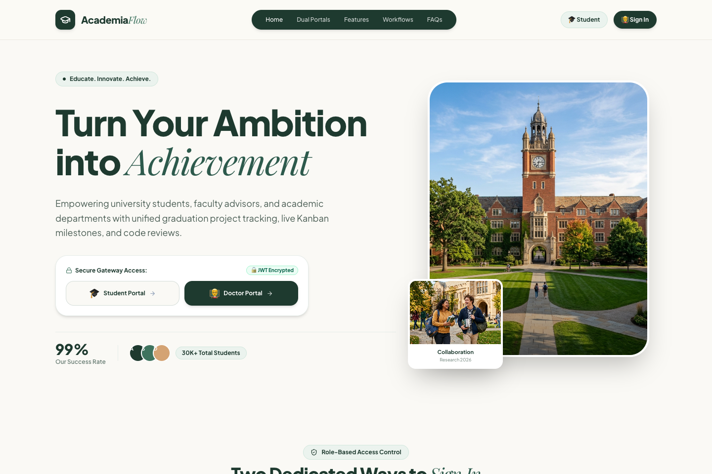
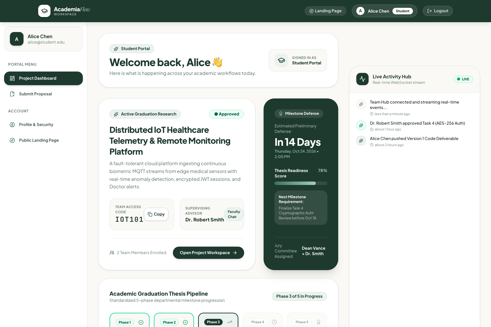
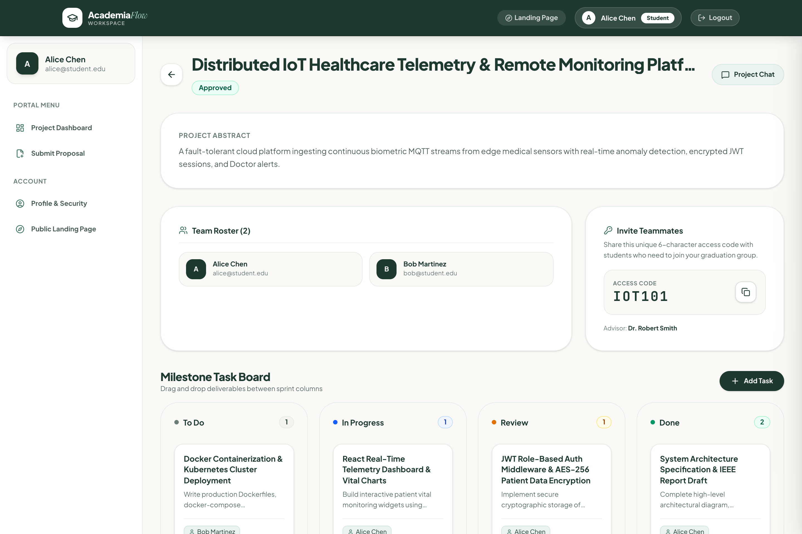
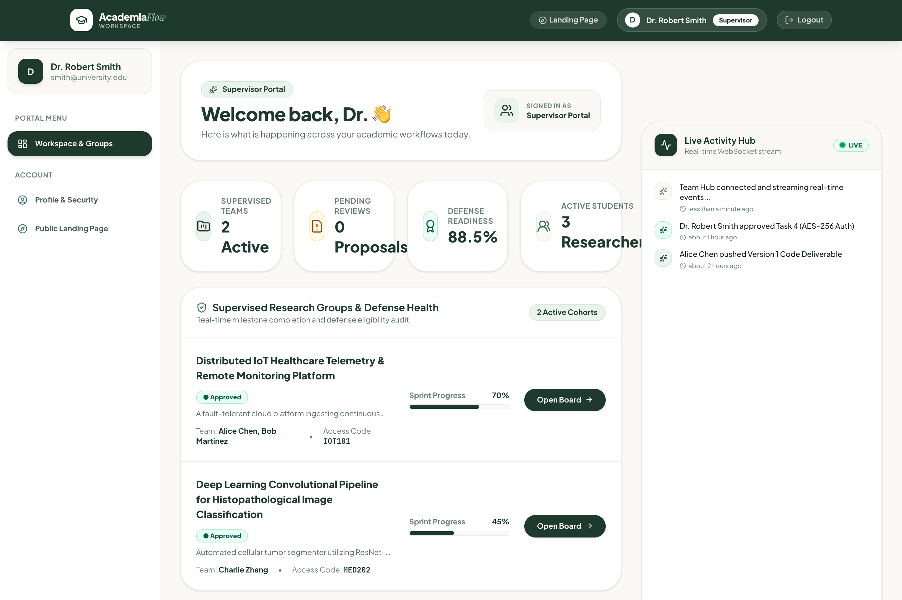
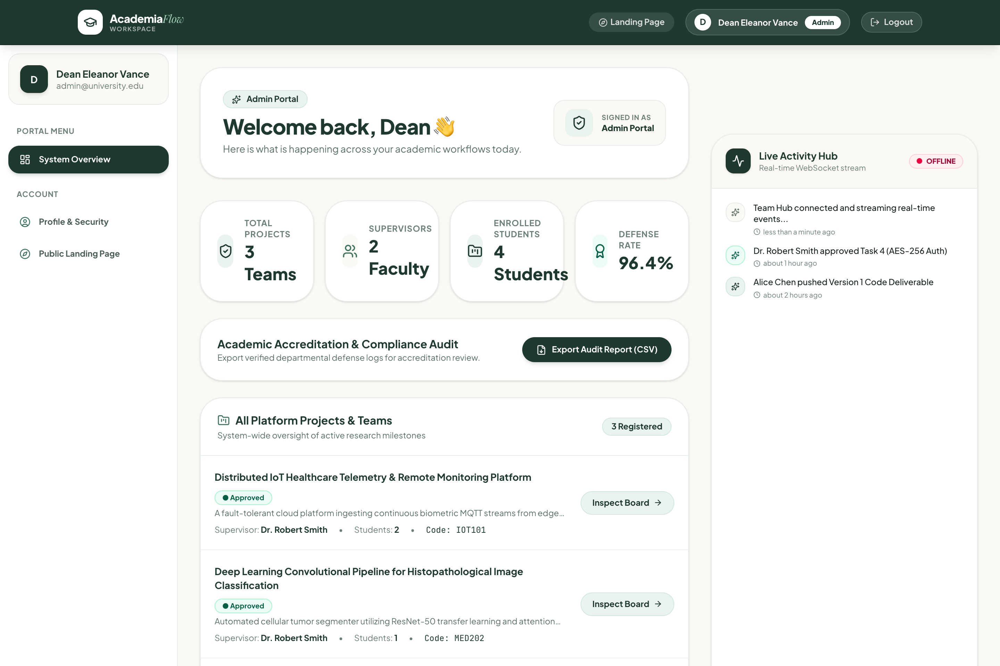

# 🎓 AcademiaFlow — Academic Project & Research Workflow Platform

<div align="center">



<p align="center">
  <strong>A modern, full-stack MERN platform orchestrating university graduation projects, thesis milestones, and advisor reviews.</strong>
</p>

[](https://react.dev/)
[](https://tailwindcss.com/)
[](https://nodejs.org/)
[](https://www.mongodb.com/)
[](https://socket.io/)
[](https://jwt.io/)

</div>

---

## 🌟 Visual Showcase & Platform Previews

### 🏛️ 1. Editorial Public Landing Page & Dual Role Gateways
> Distinct, secure entry portals for **Students** and **Faculty Advisors** featuring editorial typography (**Playfair Display** & **Plus Jakarta Sans**) and encrypted JWT authentication.

<div align="center">
  
</div>

<br />

### 🎓 2. Student Research & Milestone Dashboard
> Visual 5-Phase academic thesis progression, preliminary defense countdown clock (14-day readiness meter), academic repository links, and supervisor verdict feed.

<div align="center">
  
</div>

<br />

### 📋 3. Real-Time Kanban Sprint Board & Team Chat
> Interactive drag-and-drop task board synced across team members and faculty mentors in real time via WebSockets, with 6-character team invite code sharing.

<div align="center">
  
</div>

<br />

### 👨‍🏫 4. Faculty Supervisor & Supervisory Health Matrix
> Real-time cohort health tracking, upcoming advisory office hours, 1-click student supervision approvals, and broadcast announcement notice broadcaster.

<div align="center">
  
</div>

<br />

### 👑 5. Department Admin Oversight & Accreditation Audit
> Department-wide project analytics, supervisor capacity load balancing, graduation defense tribunal scheduler, and CSV compliance export.

<div align="center">
  
</div>

---

## ✨ Core System Features

* 🔐 **Secure Role-Based Access Control (RBAC):** Three dedicated personas (**Student**, **Supervisor / Doctor**, and **Department Admin**) fortified with `HttpOnly` cookie-stored JWT sessions.
* 🤝 **Direct Advisor Linkage System:** Students browse faculty research directories and dispatch 1-click supervision requests. Doctors manage incoming requests directly from their dashboard.
* ⚡ **Live WebSocket Synchronization:** Built on `Socket.io` channels for instant task movements, status changes, activity stream feeds, and team messaging.
* 💻 **Interactive Code Submission & Syntax Console:** Students submit deliverables via embedded source code editors or cloud document links; Advisors inspect version history with `Prism` syntax highlighting.
* 🔑 **6-Character Team Access Codes:** Rapid peer group formation with automated member onboarding.
* 📱 **Full-Spectrum Responsiveness:** Fluid adaptive layout optimized across Mobile (320px–480px), Tablets (768px–1024px), Laptops, and Ultra-wide monitors.

---

## 🛠️ Technology Stack

| Layer | Technologies |
| :--- | :--- |
| **Frontend** | React 19, Vite, Redux Toolkit, Tailwind CSS v4, Lucide Icons, React Beautiful DnD, Prism Syntax Highlighter |
| **Backend** | Node.js, Express.js, Socket.io WebSockets, Multer file processing, Cookie-Parser |
| **Database** | MongoDB & Mongoose (with automated In-Memory fallback via `mongodb-memory-server`) |
| **Security** | JSON Web Tokens (JWT), bcryptjs hashing, HttpOnly Cookie sessions, Tenant verification middleware |
| **Fonts** | Playfair Display (Editorial Serifs), Plus Jakarta Sans (Modern UI), JetBrains Mono (Code) |

---

## 🚀 Getting Started Locally

### Prerequisites
* **Node.js** (v18+ recommended)
* **npm** or **yarn**
* *Optional:* Local MongoDB instance (The backend automatically falls back to an in-memory MongoDB database pre-seeded with realistic data if local MongoDB is offline).

### 1. Clone & Install Dependencies
```bash
git clone https://github.com/MahmoudEsawi/academic-workflow-platform.git
cd academic-workflow-platform

# Install Backend Dependencies
cd backend
npm install

# Install Frontend Dependencies
cd ../frontend
npm install
```

### 2. Configure Environment Variables
Inside `backend/.env`:
```env
PORT=5001
JWT_SECRET=super_secure_academic_flow_secret_key_2026
NODE_ENV=development
MONGO_URI=mongodb://127.0.0.1:27017/academic-workflow-platform
```

### 3. Launch Development Servers
Open two terminal windows:

**Terminal 1 — Backend API & Socket Server (Port 5001):**
```bash
cd backend
npm run dev
```

**Terminal 2 — Frontend Client (Port 5173):**
```bash
cd frontend
npm run dev
```

Visit **`http://localhost:5173`** in your browser.

---

## 🧪 Pre-Seeded Demo Accounts for Testing

All test accounts share the common password: **`password123`** *(Quick-fill buttons available on the Login page)*:

| Persona | Email | Role | Key Capabilities |
| :--- | :--- | :--- | :--- |
| **Student** | `alice@student.edu` | `Student` | 5-Phase thesis pipeline, code deliverable submissions, Kanban sprint tasks, team chat |
| **Faculty Doctor** | `smith@university.edu` | `Supervisor` | Supervision request approvals, cohort health matrix, code review console, office hours |
| **Department Admin** | `admin@university.edu` | `Admin` | Department analytics, supervisor capacity balancer, defense tribunal schedule, CSV audit export |

---

## 📁 Repository Directory Structure

```
academic-workflow-platform/
├── backend/
│   ├── controllers/      # Auth, Project, Task, User, Submission, Message controllers
│   ├── middleware/       # Auth guard, Role verification, Tenant isolation
│   ├── models/           # Mongoose schemas (User, Project, Task, Submission, Message)
│   ├── routes/           # REST API route endpoints
│   └── server.js         # Express app, Socket.io integration & database seeder
├── frontend/
│   ├── public/           # Static academic imagery & assets
│   ├── src/
│   │   ├── components/   # Navbar, Sidebar, KanbanBoard, LiveTeamHub, ChatPanel, Widgets
│   │   ├── pages/        # LandingPage, Login, Signup, Dashboard, ProjectDetails, Review
│   │   ├── redux/        # Redux Toolkit state slices (auth, projects, messages, workflow)
│   │   ├── socket.js     # Socket.io client instance
│   │   └── index.css     # Design system tokens & Tailwind CSS v4 directives
├── docs/
│   └── screenshots/      # High-resolution platform preview captures
└── README.md
```

---

## 📄 License
This project is licensed under the MIT License — feel free to customize and expand for academic research workflows.
